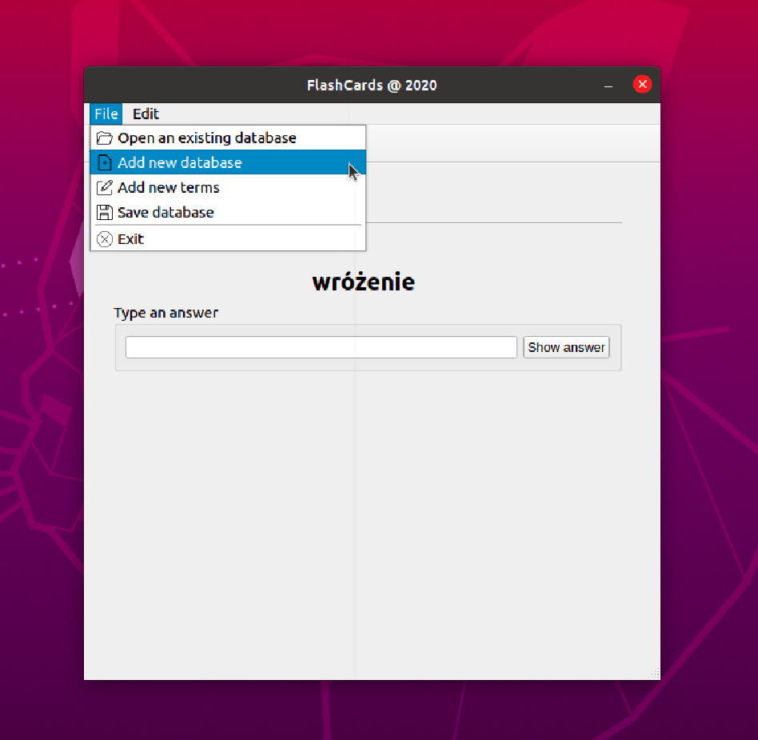

# FlashCards

Flashcard app can help you memorize knowledge. The software is similar to common flashcard programs: knowledge is stored in question-answer pairs. You add the question-answer pairs yourself or use ready-made question-answer collection. To every question you'll think about an answer, and after a while you'll be confronted with the correct answer.
At the end of the set you'll get overall summary and your score.

## Table of contents
* [Background](#background)
* [Features](#features)

### Background

The app was created to focus on the functionalities of modern C++. It shows practical usage of STL containers, Object Orient Programming, data and files manipulation, Model-View-Controller pattern. The user interface was created with Qt5 API.

### Features

The app provides some basic interface to opening, saving or creating new databases:

While learning, wrong and correct answers are displayed to the user:

Question-answer pairs can be added or deleted from the set: 

Summary (at the end of the set):

Session can be saved before the program closes and it can be continued next time user open the app: 

